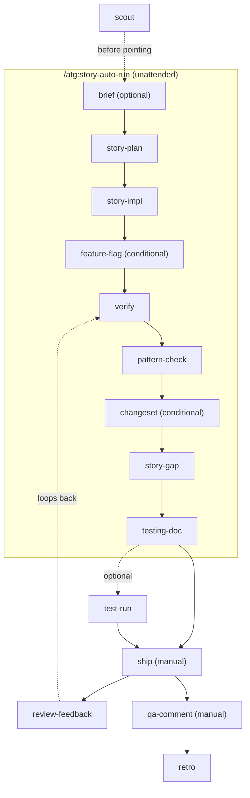

# atg-agent-kit

`atg` slash commands and skills for Claude Code and Cursor. Git-tracked source of truth;
`link.sh` deploys them into each runtime's native format so they load from any cwd or worktree.

## How the kit is organised

**Commands are thin procedures. Skills carry the shared knowledge.** A command file is a
numbered list of steps plus one output template, and it delegates every cross-cutting rule to a
skill by name. When you learn something about how the workflow should behave, it goes into a
skill, never into a command's procedure text. See [Contributing](#contributing).

| Skill | Owns |
|---|---|
| `atg-repo-profile` | Which service you are in, and its values: gate commands, repo paths, branch pattern, PR template, whether the service has changesets or feature flags. Profiles in `profiles/`, per-service recipes in `recipes/` |
| `atg-story-artifacts` | Ticket resolution, the `bin/stories/` directory layout, every file's role, the canonical `implementation-plan.md` sections, `## As-built` semantics, the never-commit-`bin/` rule, diff base and `--branch` scoping |
| `atg-lifecycle` | The command graph: order, which steps block, which are advisory, which stay manual, and what runs next after each |
| `atg-testing-guide` | Scenario-versus-step vocabulary, variable conventions for guide, test-run and Jira, and the `TESTING-GUIDE.md` template (`template.md`) |
| `atg-service-rules` | Dispatcher into each service's own rule docs, by what you are touching. Reads `rules-dir` from the profile |
| `atg-conventions-guard` | Portable copy of the Kotlin, Spring/JPA, Spock and feature-flag conventions, for harnesses that do not load a repo's rules directory |
| `atg-conventions-csharp` | The same for C#: layering, the `ArgumentException` error contract, xUnit and CSharpier hygiene |
| `atg-cross-cutting-spotter` | Portable cross-cutting checklist: migration, UUIDv7, MapStruct, soft delete, `@Transactional`, flags, events, money, downstream rewrites |
| `atg-cross-cutting-csharp` | The same for .NET: middleware order, marketplace resolution, outbound call headers, which layer publishes which message |
| `atg-pr-self-review` | Pre-ship sanity pass: clean tree, slice alignment, leftover `TODO`/`println`, changeset gate |
| `unslop` | Writing rules for anything a person reads (PR bodies, Jira comments, replies, briefs). Vendored from `cursor/plugins` so consumers need no separate install |
| `jira-cli` | Jira via `acli` with `mcp-atlassian` fallback, token-efficient field selection, the ADF comment recipe |
| `dynatrace-mcp` | Dynatrace log and metric queries via the `dynatrace-mcp` MCP server, with `reference.md` for accumulated gotchas |

Skills load automatically when their description matches. Commands are invoked by name.
The portable convention skills overlap the service rule docs on purpose: rule docs are the
authority in Claude Code, and the skills keep the conventions available in harnesses that only
load skills. When editing a convention, update the rule doc first, then the skill.

## Supported services

| Service | Detected by | Profile |
|---|---|---|
| `wavebid-a2o` (Kotlin, Gradle, monorepo) | `wavebid-a2o-service/` + `wavebid-a2o-ui/` | `skills/atg-repo-profile/profiles/wavebid-a2o.md` |
| `invoices-service` (.NET 10, standalone) | `invoices-service.sln` | `skills/atg-repo-profile/profiles/invoices-service.md` |
| `sales-order` (Go 1.27, standalone) | `sales-order.go` | `skills/atg-repo-profile/profiles/sales-order.md` |

Per-service values — build commands, paths, branch pattern, ticket prefixes, PR template, whether
the service has changesets or feature flags — live only in those profile files. `./check.sh`
fails if a service-specific token appears in a file that every service shares.

## Adding a service

**Write one file.** `skills/atg-repo-profile/profiles/<id>.md`, with every key in the
`atg-repo-profile` contract plus a `## Quality gates` table. `link.sh` discovers it from its
`detect-paths` row, so there is nothing to register: no command, skill or `link.sh` edit.

Copy an existing profile and replace the values. Where each comes from:

| Key | Where to find it |
|---|---|
| `detect-paths` | A file or directory at the repo root that no other service has. Trailing `/` also marks a subrepo whose stale `.cursor/` deploy gets pruned |
| `code-root` | Where the build runs from — often `src/`, a module dir, or `.` |
| Quality gates | CI config first (it is the contract), then the repo's own README or `CLAUDE.md`. Run each one by hand before writing it down |
| `branch-pattern`, `ticket-prefixes` | `git log --oneline -30` and `git branch -a` |
| `pr-template`, `pr-body-anchor` | The template file; the anchor is the heading the ATG block goes above |
| `changeset`, `feature-flag`, `migrations-path` | Grep for the mechanism. Absent is a real answer — write `none` and the commands will say so and stop |
| `rules-dir` | The repo's own convention docs, if any |
| `dynatrace-*` | The deployment manifests, or an existing log query |

Then run `./check.sh`. It fails if the profile is missing a contract key or a gate table.

**A stack the kit has not met needs two more files**: `skills/atg-conventions-<lang>/SKILL.md`
and `skills/atg-cross-cutting-<lang>/SKILL.md`, named by the profile's `conventions-skill` and
`cross-cutting-skill`. These are the only real writing — layering, error contract, test
conventions, and the things whose blast radius reaches past the file being edited. A service on
a stack already covered just points at the existing pair.

Two rules keep this honest. Never write a value you have not verified against the repo; a wrong
gate command is worse than a missing profile, because the command runs it. And never reach for
a value by editing a command — if something differs per service and has no key, add the key to
the contract, to `check.sh`'s required list, and to every profile.

## Using the kit from another repo

You do not need to fork it or vendor anything:

```bash
git clone https://github.com/fcastillo-atg/atg-agent-kit.git ~/ATG/atg-agent-kit
~/ATG/atg-agent-kit/link.sh                        # once per machine (Cursor, omp)
~/ATG/atg-agent-kit/link.sh --checkout /path/to/repo   # once per checkout or worktree
```

The checkout deploy refuses any repo without a matching profile, so step two is also the test
that your profile works. Re-run both after pulling kit updates — commands are copies, not
symlinks.

**If the repo tracks `.claude/`**, gitignore the deploy first. The skill symlinks hold an
absolute path into your kit checkout, so committing them breaks every other clone:

```gitignore
.claude/commands/atg/
.claude/skills/
```

Hand-written `.claude/rules/` and `CLAUDE.md` stay tracked. **Do not** gitignore
`.claude/plans/` — it holds the profile's `plans-path` file, the one repo-visible planning
artifact `/atg:story-plan` commits on the implementation branch. A repo that gitignores all of
`.claude/` needs a carve-out for that one path, or that artifact silently never reaches a PR.

## Commands

20 `/atg:*` commands. Most support one story's life cycle end to end; a handful are
cross-cutting tools you can reach for at any point.

### Life-cycle commands

| Command | Stage | What it does |
|---|---|---|
| `/atg:scout` | Groom | Audits a ticket against the codebase before pointing it. Read-only; returns pointable/blocked with evidence |
| `/atg:brief` | Plan (optional) | Socratic pre-story analysis; surfaces ambiguities and cross-cutting concerns before `story-plan` |
| `/atg:story-plan` | Plan | Branch-split implementation plan: LOC estimate, feature-flag strategy, branch breakdown, As-built placeholder |
| `/atg:story-impl` | Implement | Executes one branch of the plan as an ordered, commit-by-commit work queue |
| `/atg:feature-flag` | Implement (conditional) | Single-file feature flag (interface + Noop + Enabled + ProxyFactory) wired into the service |
| `/atg:verify` | Quality gate | Tests, Detekt, CodeNarc, Kover with auto-fix. The gate before `ship` |
| `/atg:pattern-check` | Quality gate | Diff versus comparable existing code and rule docs. Advisory only |
| `/atg:changeset` | Quality gate (conditional) | Pointer to the monorepo changeset procedure |
| `/atg:story-gap` | Pre-ship | Every acceptance criterion accounted for in the diff. Blocks on a missing AC |
| `/atg:testing-doc` | Pre-ship | Writes `TESTING-GUIDE.md` (optionally `scenarios/*.sh`) |
| `/atg:test-run` | Pre-ship (optional) | Executes the guide via curl, asserts, writes `TESTING-PROGRESS.md` |
| `/atg:ship` | Ship (manual) | Creates the PR from the monorepo template, transitions Jira |
| `/atg:qa-comment` | Post-merge (manual) | Drafts and posts a Postman-style QA comment to Jira after approval |
| `/atg:retro` | Wrap-up | Mines the story for durable patterns; writes only what you pick |
| `/atg:story-auto-run` | Orchestrator | Chains brief through testing-doc for one branch, unattended. `ship` and `qa-comment` stay manual |

### Cross-cutting commands

| Command | What it does |
|---|---|
| `/atg:status` | Text table of branch, PR, CI and Jira state for a story |
| `/atg:story-view` | Read-only lifecycle dashboard published as an Artifact page |
| `/atg:explain` | Plain-language "what am I about to merge" with before/after examples |
| `/atg:review-feedback` | Classify PR comments, fix, reply in-thread, push, with confirmation gates |
| `/atg:pr-comment` | Post one inline review finding on a PR |

### Workflow

The authoritative graph, successor table and gate semantics live in the `atg-lifecycle` skill.
Summary:



[`docs/example-story-walkthrough.md`](docs/example-story-walkthrough.md) follows one story
through the whole timeline with abbreviated output at each step.

## Install (user-level, any machine)

```bash
~/ATG/atg-agent-kit/link.sh
```

Deploys Cursor commands to `~/.cursor/commands/atg-*.md` as real file copies, flat, with YAML
frontmatter stripped and the description hoisted to line 1 (Cursor's picker uses line 1 and has
no `ns:cmd` syntax, so they appear as `/atg-brief`). Claude Code commands and skills are
project-scope only and are not deployed here; a user-level copy would show every command twice.

Real copies rather than symlinks: re-run `link.sh` after editing a command. Safe to re-run; it
prunes only its own prior outputs. Restart Cursor after the first install.

## Point a checkout or worktree at the kit

```bash
~/ATG/atg-agent-kit/link.sh --checkout /path/to/repo
```

Accepts any repo matching a profile's marker (see `## Supported services`); run with no path
from anywhere inside one. Copies commands into `<root>/.claude/commands/atg/` and symlinks each
`skills/<name>/` directory into `<root>/.claude/skills/`, naming the resolved profile as it
goes. Refuses to run unless the kit has a clean commit.

A repo that tracks `.claude/` needs both paths gitignored — the skill symlinks hold an absolute
path into this kit, so committing them breaks every other clone.

## Install for teammates

```bash
cd ~/ATG   # or wherever you keep wavebid-a2o
git clone https://github.com/fcastillo-atg/atg-agent-kit.git
```

Then run the user-level install once and `--checkout` once per checkout or worktree. Re-run both
after pulling kit updates.

## Contributing

Every command follows one skeleton: frontmatter `description`, title, one-sentence purpose,
`## Usage`, numbered `## Steps`, one output template where the shape matters, an optional
`## Failures` table, and a single `**Next:**` line taken from `atg-lifecycle`. Target under 150
lines; over 250 means knowledge has leaked in that belongs in a skill.

Adding a command: create `commands/atg/<name>.md`, add a row to the table above and to the
`atg-lifecycle` successor table, run `link.sh` and `link.sh --checkout`.

Adding knowledge: if two or more commands need the same rule, it goes in a skill. If it is a
codebase convention, it belongs in that service's own rules directory, and the kit only points
at it. If it differs between services, it belongs in a profile.

Run `./check.sh` before every commit. It fails if a shared command or skill names a service
instead of a profile key, if a profile is missing a contract key, or if `link.sh` does not know
a profile.

## Why this exists

The content previously lived as untracked directories inside the gitignored `wavebid-a2o/.claude/`
tree: invisible to git, destroyed by `git clean -xfd`, and undiscoverable at their original
nesting depth. This kit gives it real history, cwd-independent deploys, and a flat skill layout.
