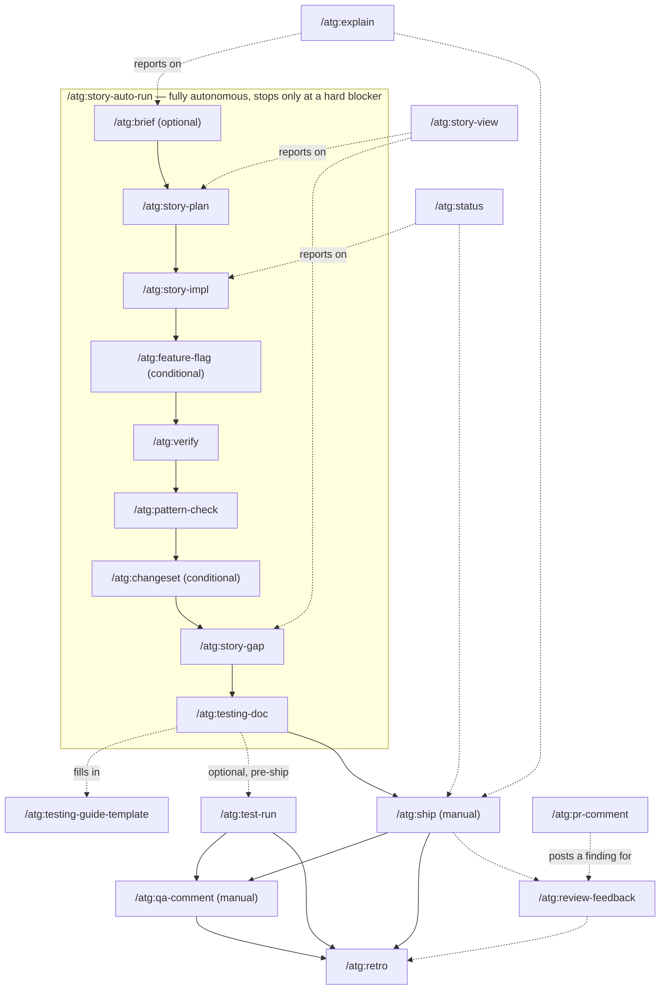

# atg-agent-kit

`atg` slash commands and skills for Claude Code and Cursor. Git-tracked backup and single
source of truth; `link.sh` deploys them into each runtime's native format so they load from
any cwd or worktree.

## Contents

- [Commands](#commands) — 20 `/atg:*` slash commands, what each does, and how they chain
  together, with a diagram. See [`docs/example-story-walkthrough.md`](docs/example-story-walkthrough.md)
  for one story followed through the whole timeline with example output at each step.
- [Skills](#skills) — 6 flat skill directories (flattened from the repo's nested
  `skills/atg/<name>/` layout, which wasn't discovered at that nesting depth).
- `link.sh` — idempotent installer (see [Install](#install-user-level-any-machine) below).

## Commands

20 `/atg:*` slash commands. Most exist to support one story's life cycle end to end; a
handful are cross-cutting tools you can reach for at any point in that life cycle.

### Life-cycle commands

| Command | Stage | What it does |
|---|---|---|
| `/atg:brief` | Plan (optional) | Socratic pre-story analysis — surfaces ambiguities and cross-cutting concerns before `story-plan` runs. |
| `/atg:story-plan` | Plan | Creates a branch-split implementation plan for a WBPR story — LOC estimate, feature-flag strategy, branch breakdown, As-built placeholder. |
| `/atg:story-impl` | Implement | Executes the story-plan for the current branch — aligns git state, builds a work queue from `implementation-plan.md`. |
| `/atg:feature-flag` | Implement (conditional) | Generates a single-file feature flag (interface + Noop + Enabled + ProxyFactory) and wires it into the service. |
| `/atg:verify` | Quality gate | Runs all quality gates (tests, Detekt, CodeNarc, Kover) and auto-fixes violations — the gate before `ship`. |
| `/atg:pattern-check` | Quality gate | Cross-references the PR diff against existing codebase patterns and project rules to catch antipatterns before shipping. |
| `/atg:changeset` | Quality gate (conditional) | Pointer to the monorepo changeset procedure — CI requires a `.changeset` for service/ui PRs unless skip-changelog. |
| `/atg:story-gap` | Pre-ship check | Verifies every acceptance criterion from the story is addressed before shipping. |
| `/atg:testing-doc` | Pre-ship check | Generates testing documentation (a `TESTING-GUIDE.md`, optionally scenario files with `--with-scenarios`). |
| `/atg:testing-guide-template` | (helper) | The merged template `testing-doc` fills in — not run on its own. |
| `/atg:ship` | Ship (manual) | Creates a PR once `verify` passes — respects the monorepo PR template, adds ATG context, transitions the Jira ticket. |
| `/atg:qa-comment` | Post-merge (manual) | Drafts and posts QA testing steps as a Jira comment — an HTTP guide for QA to run on dev/stage after merge. |
| `/atg:test-run` | Post-merge | Executes the scenarios from a `TESTING-GUIDE.md` — authenticates, runs each step via curl, asserts results, generates `TESTING-PROGRESS.md`. |
| `/atg:retro` | Wrap-up | Post-merge retrospective — mines session artifacts and suggests durable patterns for the user to review and selectively add to `CLAUDE.md`/`.claude/rules/`. |
| `/atg:story-auto-run` | Orchestrator | Chains `brief → story-plan → story-impl → (feature-flag) → verify → pattern-check → (changeset) → story-gap → testing-doc` for one branch, fully autonomous, stopping only at a hard blocker. `ship` and `qa-comment` stay manual. |

### Cross-cutting commands

Not tied to one stage — reach for these at any point in a story's life cycle.

| Command | What it does |
|---|---|
| `/atg:status` | Quick multi-branch story status overview — shows which branches are merged, open, or pending. |
| `/atg:explain` | Plain-language brief of what a ticket/branch changes — verdict, before/after examples, behavior matrix, merge confidence. |
| `/atg:story-view` | Renders a story's current life-cycle position (`brief → ship → docs → retro`) as a read-only visual dashboard, published via Artifact. |
| `/atg:review-feedback` | Unified PR comment classifier and resolver — handles both human-reviewer comments and bot comments in one flow. |
| `/atg:pr-comment` | Posts a single, concise inline PR review comment (finding + proposed fix) on GitHub. |

### How they reference each other

Edges below come straight from `/atg:*` mentions inside each command file — i.e. where one
command's instructions explicitly point at another.

- **The auto-run chain** (`story-auto-run`) is the backbone: `brief → story-plan → story-impl
  → feature-flag → verify → pattern-check → changeset → story-gap → testing-doc`. Every
  command in that chain also stands alone — you can run `/atg:verify` by itself without ever
  touching `story-auto-run`.
- **`ship`** sits right after the chain (not part of it — stays manual) and fans out to
  everything post-merge: `changeset`, `qa-comment`, `retro`, `review-feedback`,
  `testing-doc`, `verify`.
- **`testing-doc` → `testing-guide-template`**: `testing-doc` reads the template command's
  content to fill in `TESTING-GUIDE.md`. **`test-run` then executes what `testing-doc`
  produced** — optionally, before `ship` even runs, specifically to catch bugs unit tests
  miss before merging.
- **`qa-comment`** references `test-run`, `testing-doc`, and `retro` — it explicitly runs
  **after** `test-run` confirms every scenario passes locally, then reposts the same
  `testing-doc` content as Jira-facing instructions for QA to independently verify on
  dev/stage.
- **`pr-comment`** feeds into **`review-feedback`**: a single posted finding is exactly the
  kind of thing `review-feedback` later classifies and resolves.
- **`explain`** and **`story-view`** are the two "summarize everything" tools — both reference
  most of the life-cycle commands (`brief`, `pattern-check`, `story-gap`, `verify`, plus
  `ship`/`status`/`review-feedback` for `explain`) because their job is to report on where a
  story stands across all of them, not to hand off to a specific next step.
- **`status`** references `story-impl`, `ship`, `verify`, `review-feedback`, `retro` — same
  reporting role as `explain`/`story-view`, but scoped to "which branches are at which stage"
  rather than one story's detail.

### Workflow diagram



Dashed edges are "reports on" / "feeds into" relationships; solid edges are the sequential
hand-off order. `story-auto-run` runs the boxed chain unattended; `ship` and `qa-comment` are
deliberately left as manual steps even when the rest of the chain ran automatically.

See [`docs/example-story-walkthrough.md`](docs/example-story-walkthrough.md) for one story
followed through this whole timeline, with abbreviated real output at every step.

## Skills

Skills load automatically when their trigger condition matches (a file type being edited, a
ticket ID in conversation, a phrase the user says) — they're not invoked by name like
commands.

| Skill | Triggers on |
|---|---|
| `atg-story-context` | A WBPR ticket ID appears in conversation, the current branch matches `fc/WBPR-*`, or the user asks for story status, implementation guidance, or PR readiness. |
| `atg-conventions-guard` | Editing `.kt`/`.groovy` files in `wavebid-a2o-service`, after backend edits, or reviewing a service PR diff before `/atg:verify`. |
| `atg-cross-cutting-spotter` | Adding entities, repository methods, schema fields, delete behavior, multi-step operations, or user-facing changes in `wavebid-a2o-service`. |
| `atg-pr-self-review` | Ready to ship a branch, the user says "prepare PR"/"ready to ship", or after `/atg:verify` succeeds and before push or PR creation. |
| `jira-cli` | Any `/atg:*` command that needs Jira — fetching issues/comments, searching JQL, transitioning status, adding comments. Wraps `acli`, falls back to the `mcp-atlassian` MCP server. |
| `dynatrace-mcp` | Querying Dynatrace logs, metrics, or problems for `wavebid-a2o-service` via the `dynatrace-mcp` MCP server. |

## Install (user-level, any machine)

```bash
~/ATG/atg-agent-kit/link.sh
```

Deploys one way, user-level:

- **Cursor (CLI + UI)** → `~/.cursor/commands/atg-*.md` — real file copies, **flat**
  (no subdir), with YAML frontmatter **stripped** and the description hoisted to line 1.
  Cursor's CLI picker uses line 1 as the description; a leading `---` renders as
  `--- (user)`. Exposed as `/atg-brief` (hyphen — Cursor has no `ns:cmd` syntax). That
  strip-and-hoist transform necessarily produces a new file, so this is a real copy,
  never a symlink to the original.

Claude Code commands and skills are **not** deployed here — they're project-scope only,
deployed per checkout below. Claude Code lists user- and project-scope commands separately
(no dedupe by name), so a user-level copy would show every `/atg:*` twice in the picker.

Trade-off of real copies over symlinks: the kit is the source of truth — re-run `link.sh`
after editing a command.

Safe to re-run; prunes only its own prior outputs. Restart Cursor after the first install —
discovery runs at session init, not on a watcher.

## Point a wavebid checkout/worktree at the kit

```bash
~/ATG/atg-agent-kit/link.sh --checkout /path/to/wavebid-a2o
```

Deploys real file copies into `<root>/.claude/commands/atg/` (Claude Code project) and
re-links skills. Cursor is served entirely user-level (above), so this does **not** touch
project `.cursor/` — it only removes any stale `.cursor/commands/atg/` subdir left by
older `link.sh` versions (those caused UI duplicates). Refuses to run unless the kit has a
clean commit.

## Install for teammates

The repo is public — anyone with the link can clone it, no invite needed. It doesn't need to
sit inside (or specifically next to) a `wavebid-a2o` checkout — `link.sh` finds its own
location automatically — but a sibling directory, the same way the author keeps it, is the
simplest layout to remember:

```bash
cd ~/ATG   # or wherever you keep wavebid-a2o
git clone https://github.com/fcastillo-atg/atg-agent-kit.git
```

Then follow the two sections above: the user-level install once, and `--checkout` once per
`wavebid-a2o` checkout/worktree you work in. Re-run both after pulling kit updates —
`link.sh` is idempotent and safe to re-run anytime.

## Why this exists

The content previously lived as untracked real directories inside the gitignored
`wavebid-a2o/.claude/` tree — invisible to `git`, destroyed by `git clean -xfd`, and (the
skills) undiscoverable at their original nesting depth. This kit fixes all three: real git
history, cwd-independent deploys, and a flat skill layout.
