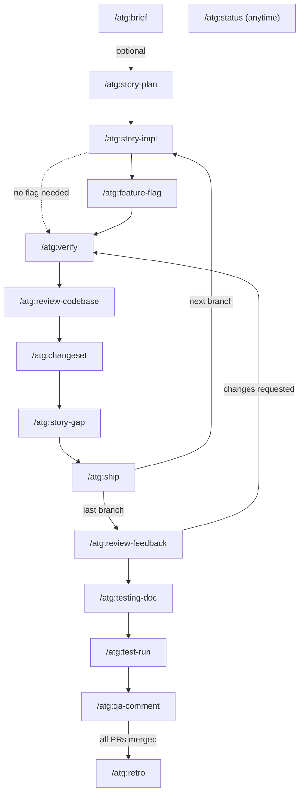

# ATG Custom Commands (Cursor — monorepo mirror)

**Canonical directory:** `~/ATG/atg-agent-kit/commands/atg/` (git-tracked). The paths under `wavebid-a2o` (`.claude/commands/atg`, `.cursor/commands/atg`, and the `wavebid-a2o-service/` equivalents) plus `~/.claude/commands/atg/` are all symlinks into it. Run `~/ATG/atg-agent-kit/link.sh` after adding or removing a command.

This namespace contains project-specific commands for the wavebid-a2o-service Spring Boot application.

## Workflow Overview

### Lifecycle at a glance

| Phase | Command | Required? | Key output |
|-------|---------|-----------|------------|
| **Pre-planning** | `/atg:brief` | Optional (complex/risky tickets) | `## Pre-Analysis` + **`## Next ATG command`** (footer) in `implementation-plan.md` |
| **Planning** | `/atg:story-plan` | Always | `implementation-plan.md` (branches + `## As-built` placeholder + **`## Next ATG command`** replaces brief footer) |
| **Implementation** *(repeat per branch)* | `/atg:story-impl` | Always | Numbered work queue for branch N |
| | `/atg:feature-flag` | If user-facing change | `*FeatureFlag.kt` + wired service |
| | *code the branch* | | — |
| | `/atg:verify` | Always (loop until green) | Green quality gates |
| | `/atg:review-codebase` | Recommended (advisory) | Findings table — antipatterns vs. existing code + rules |
| | `/atg:changeset` | If `service/` or `ui/` changed | `.changeset/*.md` on branch |
| | `/atg:story-gap` | Always (gates ship) | AC coverage table |
| | *fill `## As-built`* | **Last branch only** | Plan updated with final shipped state |
| | `/atg:ship` | Always | PR created; Jira → In Review |
| **Review** *(per PR, may iterate)* | `/atg:review-feedback` | When comments arrive | Fixes applied + in-thread replies posted |
| | `/atg:verify` | After every fix cycle | Green quality gates |
| **Documentation** *(before or after merge)* | `/atg:testing-doc` | After last branch coded | `TESTING-GUIDE.md` (reads `## As-built`) |
| | `/atg:test-run` | Recommended | Executes scenarios via curl; `TESTING-PROGRESS.md` |
| | `/atg:qa-comment` | After `/atg:test-run` passes | QA-ready HTTP comment posted to Jira |
| **Post-merge** | `/atg:retro` | After all PRs merged | Patterns appended to `CLAUDE.md` |
| **Anytime** | `/atg:status` | On-demand | Branch state + CI + Jira snapshot |
| | `/atg:story-view` | On-demand | Read-only visual dashboard (Artifact link) of a story's full lifecycle position |
| **Shortcut** | `/atg:story-auto-run` | Optional, one branch at a time | Chains brief → story-plan → story-impl → (feature-flag) → verify → review-codebase → (changeset) → story-gap → (As-built, last branch) → testing-doc (last branch); stops at a hard blocker; never runs `ship` or `qa-comment` |

---

### Flow diagram

```
┌─ PRE-PLANNING (optional) ──────────────────────────────────────────────────┐
│  /atg:brief [--auto | --discuss]                                           │
│    └─ writes ## Pre-Analysis → implementation-plan.md                     │
└────────────────────────────────────────────────────────────────────────────┘
                              ↓
┌─ PLANNING ─────────────────────────────────────────────────────────────────┐
│  /atg:story-plan                                                           │
│    └─ writes implementation-plan.md                                        │
│         ├─ ## Branch strategy  (N branches, each ~≤500 LOC)               │
│         └─ ## As-built         (placeholder — fill after last branch)     │
└────────────────────────────────────────────────────────────────────────────┘
                              ↓
┌─ IMPLEMENTATION  ── repeat for each branch (Branch 1 → Branch N) ─────────┐
│                                                                            │
│  /atg:story-impl [--branch N]                                             │
│    └─ work queue: files, ACs, feature-flag-first rule                     │
│                              ↓                                             │
│  [if user-facing change]                                                   │
│  /atg:feature-flag                                                         │
│    └─ *FeatureFlag.kt  (interface + Noop + Enabled + ProxyFactory)        │
│                              ↓                                             │
│  ┌── code the branch ──────────────────────────────────────────────────┐  │
│  │  edit Kotlin / Groovy / SQL / Liquibase                             │  │
│  └─────────────────────────────────────────────────────────────────────┘  │
│                              ↓                                             │
│  /atg:verify                      ← loop until all gates green (max 3×)   │
│    ├─ [db/changelog changed] liquibaseUpdate                               │
│    ├─ ./gradlew test                                                       │
│    ├─ ./gradlew detektMain detektTest                                      │
│    ├─ ./gradlew codenarcTest                                               │
│    └─ ./gradlew koverVerify  (≥85% branch, ≥95% line)                    │
│                              ↓                                             │
│  /atg:review-codebase [--branch N]        ← advisory, never blocks       │
│    ├─ rules pass: diff vs. .claude/rules/*.md                             │
│    └─ codebase pass: diff vs. 2-3 comparable existing implementations    │
│                              ↓                                             │
│  [if service/ or ui/ changed]                                              │
│  /atg:changeset  →  .changeset/*.md  (or plan skip-changelog on PR)       │
│                              ↓                                             │
│  /atg:story-gap [--branch N]                                               │
│    ├─ ✅ AC covered + tested  →  proceed                                   │
│    ├─ ⚠️  AC covered, no test  →  proceed (review recommended)            │
│    └─ ❌ AC missing            →  BLOCKED — fix before ship               │
│                              ↓                                             │
│  [last branch only]                                                        │
│  fill ## As-built in implementation-plan.md        ← /atg:ship reminds   │
│    └─ document final state: DB · entity · API · repo · handler · SQL      │
│                              ↓                                             │
│  /atg:ship [--branch N]                                                    │
│    ├─ As-built check  (warns if missing on last branch)                   │
│    ├─ changeset pre-flight  (blocks if .changeset missing + no label)     │
│    ├─ reads pull_request_template.md + prepends ATG summary block         │
│    ├─ git push -u origin HEAD                                              │
│    ├─ gh pr create                                                         │
│    └─ Jira → "In Review"                                                  │
│                              ↓                                             │
│  ┌── if more branches remain ─────────────────────────────────────────┐   │
│  │  repeat IMPLEMENTATION block for Branch N+1                        │   │
│  └─────────────────────────────────────────────────────────────────────┘  │
└────────────────────────────────────────────────────────────────────────────┘
                              ↓
┌─ REVIEW  ── per PR, may iterate ───────────────────────────────────────────┐
│  /atg:review-feedback {PR_NUMBER}                                         │
│    ├─ fetch: inline review + timeline + bot comments                      │
│    ├─ classify: ✅ fix · ✅ answer · ⚠️ stale · ❌ skip                   │
│    ├─ print review matrix  →  STOP (wait for confirmation)                │
│    ├─ apply ✅ fix items                                                   │
│    ├─ /atg:verify  (full gates — not just detekt)                         │
│    ├─ ask before posting replies in-thread (one reply per comment)        │
│    └─ ask before commit + push                                             │
│                              ↓                                             │
│  ┌── if reviewer requests more changes ───────────────────────────────┐   │
│  │  repeat REVIEW block                                               │   │
│  └─────────────────────────────────────────────────────────────────────┘  │
└────────────────────────────────────────────────────────────────────────────┘
                              ↓
┌─ DOCUMENTATION + QA  ── before OR after merge, either order works ─────────┐
│  /atg:testing-doc [--with-scenarios]                                      │
│    ├─ reads ## As-built  (source of truth for post-implementation state)  │
│    ├─ falls back to src/ files if ## As-built missing                     │
│    └─ writes testing/TESTING-GUIDE.md  (+scenarios/*.http if flagged)    │
│                              ↓                                             │
│  /atg:test-run {TICKET}                     ← useful pre-merge too       │
│    ├─ executes every shared-setup + scenario step via curl                │
│    ├─ asserts status codes + field values, extracts {{variables}}         │
│    └─ writes testing/TESTING-PROGRESS.md                                  │
│                              ↓                                             │
│  /atg:qa-comment {TICKET}                   ← gated on test-run passing  │
│    ├─ builds Postman-format HTTP steps from TESTING-GUIDE.md              │
│    ├─ shows draft, waits for explicit approval                            │
│    └─ posts comment to Jira (for QA to verify on dev/stage)               │
└────────────────────────────────────────────────────────────────────────────┘
                              ↓  (all PRs merged)
┌─ POST-MERGE ───────────────────────────────────────────────────────────────┐
│  /atg:retro                                                               │
│    ├─ mines PR comments + ## As-built + Detekt/CodeNarc patterns          │
│    ├─ extracts durable patterns (not one-off decisions)                   │
│    └─ appends to CLAUDE.md / .claude/rules/service-patterns.md           │
└────────────────────────────────────────────────────────────────────────────┘

  /atg:status  ─── usable at any point ──────────────────────────────────────
    └─ reads ## Branch strategy  →  queries gh + Jira  →  prints state table
```

### Command flow (Mermaid)



### `## As-built` data flow

`## As-built` is a section in `implementation-plan.md` that captures the **final shipped state** of every changed layer. It is the connective tissue between the implementation commands and the documentation commands.

```
story-plan   →  creates placeholder in implementation-plan.md
story-impl   →  reminds to fill on last branch (verification checklist)
ship         →  warns/blocks if missing on last branch before PR
retro        →  uses it for planned-vs-actual comparison; offers to backfill
testing-doc  →  reads it as source of truth (falls back to src/ if absent)
```

> ⚠️ The `## Current state` section in `implementation-plan.md` is a **planning-time snapshot** — it describes the codebase *before* implementation. Never use it as the current implementation reference; use `## As-built` instead.

---

## Available Commands

### `/atg:brief`
**Optional pre-story deep-dive** — surface ambiguities and cross-cutting concerns before `story-plan` runs.

**Usage:**
```bash
/atg:brief WBPR-4032
/atg:brief WBPR-4032 --auto     # silent: log assumptions, ask no questions
/atg:brief WBPR-4032 --discuss  # force interactive Socratic mode
```

**When to use:**
- Story has vague ACs or touches shared infrastructure (RabbitMQ, Aurora, Redis, Liquibase)
- Story points > 8 or expected LOC > 500
- You want a design checkpoint before committing to an implementation plan

**What it does:**
- Fetches story and comments from Jira (`jira-cli` skill: acli, falls back to Atlassian MCP)
- Runs 4-lens analysis: vague ACs, codebase gaps, cross-cutting concerns, scope risks
- Checks ATG cross-cutting checklist (Liquibase migrations, feature flags, RabbitMQ events, soft-delete, UUIDv7, MapStruct, `@Transactional`)
- Asks up to 3 targeted questions (or logs assumptions with `--auto`)
- Writes `## Pre-Analysis` to `bin/stories/{year}/{month}/{TICKET}-{slug}/implementation-plan.md`
- Appends **`## Next ATG command`** at the end of that file (same text as the chat handoff; replace on re-run)
- `story-plan` detects `## Pre-Analysis` and skips its own analysis

---

### `/atg:story-plan`
Creates comprehensive implementation plans with branch-based code splitting strategy.

**Usage:**
```bash
/atg:story-plan WBPR-3215
/atg:story-plan "Implement lot end time propagation optimization"
```

**What it does:**
- Resolves story from existing `{TICKET}-story.md` or fetches from Jira (with comments, via `jira-cli` skill)
- Analyzes story requirements and existing codebase
- Estimates total lines of code (production + test + docs)
- Applies branch splitting rule: 1 branch if ≤500 LOC; 2 if 501–999; ceil(total/500) if ≥1000
- Designs feature flag strategy (if needed)
- Creates detailed branch breakdown with files, LOC, testing strategy, PR templates
- Outputs to `bin/stories/{year}/{month}/{TICKET}-{slug}/implementation-plan.md` (branch breakdown lives under `## Branch strategy`; no separate `branch-strategy.md`)
- Ends the file with **`## Next ATG command`** → `/atg:story-impl` (replaces the brief-only footer if present); chat message repeats the same block

**Branch Splitting Rule:**
- **≤500 LOC total**: 1 branch (~400–500 LOC baseline)
- **501–999 LOC total**: 2 branches (~≤500 LOC each)
- **≥1000 LOC total**: ceil(total/500) branches; merge remainder <100 LOC into last branch

---

### `/atg:story-impl`
**Execute the story plan** for the current git branch — turns `implementation-plan.md` (`## Branch strategy` / `### Branch N:`) into an ordered work queue (this branch only).

**Usage:**
```bash
/atg:story-impl
/atg:story-impl WBPR-4032
/atg:story-impl WBPR-4032 --branch 2
```

**What it does:**
- Resolves `{TICKET}` from the branch name or `bin/stories/**/*{TICKET}*`
- Reads `implementation-plan.md` under `bin/stories/{year}/{month}/{TICKET}-{slug}/`
- Confirms `git branch --show-current` matches the planned branch for slice `N`
- Emits a numbered checklist (files, ACs, feature-flag-first on Branch 1 when required)
- Does not run Gradle — run `/atg:verify` after coding

**Changeset reminder:** before `/atg:ship`, if the PR touches `wavebid-a2o-service/` or `wavebid-a2o-ui/`, add a changeset via **`/gsd/changeset-wavebid-a2o`** (Cursor) or **`/atg:changeset`** (pointer to the same procedure), or plan the **`skip-changelog`** PR label.

---

### `/atg:feature-flag`
Creates production-ready feature flags following the consolidated single-file pattern.

**Usage:**
```bash
/atg:feature-flag Create feature flag for auction address propagation
```

**What it does:**
- Creates single-file feature flag with interface, `Noop` implementation, enabled implementation, and `ProxyFactory`
- Updates service dependencies (inject interface, not implementation)
- Updates test fixtures
- Uses cookie-based control: `FF_{feature_name}=true`
- Ensures Detekt and CodeNarc compliance

**Note:** `/atg:story-plan` automatically integrates this for features requiring gradual rollout.

---

### `/atg:testing-doc`
Generates comprehensive HTTP-based testing documentation from story files and implementation plans.

**Usage:**
```bash
# Auto-detect story files in bin/stories/
/atg:testing-doc

# With HTTP scenario files
/atg:testing-doc --with-scenarios

# Specify explicit paths
/atg:testing-doc --story bin/stories/2026/04/WBPR-3215-lot-address/WBPR-3215-story.md
```

**What it does:**
- Auto-detects story and implementation plan files from `bin/stories/{year}/{month}/{TICKET}-{slug}/`
- Generates a single **`TESTING-GUIDE.md`** (overview, quick reference, and detailed scenarios in one file)
- Optionally generates `scenarios/*.http` files (one per scenario) with `--with-scenarios`
- Outputs to `bin/stories/{year}/{month}/{TICKET}-{slug}/testing/`

---

### `/atg:test-run`
Executes every scenario in a `TESTING-GUIDE.md` mechanically via `curl` — a companion to manual testing, and useful pre-merge to catch bugs unit tests miss (e.g., Hibernate flush-order issues, constraint violations).

**Usage:**
```bash
/atg:test-run WBPR-4127                     # auto-discover guide under bin/stories/
/atg:test-run WBPR-4127 --stop-on-fail      # halt after first assertion failure
/atg:test-run WBPR-4127 --skip-cleanup      # leave test data in place after run
/atg:test-run WBPR-4127 --retest-only       # re-run only previously failed scenarios
```

**What it does:**
- Auto-discovers `TESTING-GUIDE.md` from the ticket ID (or accepts a direct path)
- Checks/starts the app, authenticates, runs shared setup then each scenario's steps via `curl`
- Extracts `{{variables}}` from JSON responses, asserts status codes and field values
- Generates `testing/TESTING-PROGRESS.md` with full request/response JSON per step and a pass/fail summary
- Offers to clean up test data created during the run (unless `--skip-cleanup`)

---

### `/atg:qa-comment`
Drafts and posts a self-contained QA testing comment to Jira, in the same Postman-compatible HTTP format as `TESTING-GUIDE.md`, so QA can independently verify on dev/stage. **Always shows a draft and waits for explicit approval before posting.**

**Usage:**
```bash
/atg:qa-comment WBPR-4243               # draft → approve → post
/atg:qa-comment WBPR-4243 --dry-run     # print draft only, do not post
```

**What it does:**
- Requires `testing/TESTING-GUIDE.md` (gate: stops if not found, points to `/atg:testing-doc`)
- Optionally reads `TESTING-PROGRESS.md` to confirm all scenarios passed, and `## As-built` for scope/AC deferral notes
- Detects PR state to build the correct environment line (dev/stage)
- Assembles curl-based test steps into the canonical comment template
- Posts via `jira-cli` skill (acli, falls back to Atlassian MCP) after approval and confirms

---

### `/atg:verify`
Runs comprehensive quality verification after code changes.

**Usage:**
```bash
/atg:verify
```

**What it does:**
- Runs from **`wavebid-a2o-service`**: all `./gradlew` commands assume that working directory
- **Liquibase:** If `src/main/resources/db/changelog/` changed, runs `./gradlew liquibaseUpdate` before tests; if tests fail with schema-like errors or mass failures, tries `liquibaseUpdate` once then re-runs tests (local Postgres must be up — e.g. `infra/init-dependencies.sh` starts Postgres and applies migrations)
- Runs all tests (`./gradlew test`)
- Runs Kotlin static analysis (`./gradlew detektMain detektTest`)
- Runs Groovy static analysis (`./gradlew codenarcTest`)
- Verifies code coverage (`./gradlew koverVerify`) — ≥85% branch, ≥95% line
- Auto-fixes common violations; retries until all gates pass (max 3 cycles)
- Sequential: optional Liquibase preflight → tests → Detekt → CodeNarc → Kover; does not proceed to next gate until current passes

---

### `/atg:review-codebase`
Cross-references the diff against existing codebase patterns and project rule docs to catch antipatterns before shipping. **Advisory only — never blocks.**

**Usage:**
```bash
/atg:review-codebase WBPR-4032
/atg:review-codebase WBPR-4032 --branch 2
```

**What it does:**
- Gets the diff (`git diff origin/main...HEAD`, scoped via `implementation-plan.md` if `--branch N` given)
- Classifies each changed non-test file by shape (controller, service, repository/entity, mapper, feature flag, migration, event)
- **Rules pass:** checks the diff directly against the relevant numbered docs in `wavebid-a2o-service/.claude/rules/`
- **Codebase pass:** for each shape, finds 2-3 comparable existing implementations elsewhere in the codebase and compares structural conventions (error handling, transactional boundaries, null handling, logging, mapper usage) — flags meaningful divergences as possible antipatterns
- Prints a findings table with severity; if no comparable precedent exists for a file, says so rather than forcing a finding
- Always ends by pointing to `/atg:story-gap` regardless of findings

---

### `/atg:changeset`
**Pointer** to the monorepo changeset workflow — does not duplicate the full spec.

**Usage:**
```bash
/atg:changeset
```

**What it does:**
- Summarizes the CI rule: PRs that change `wavebid-a2o-service/` or `wavebid-a2o-ui/` need a `.changeset/*.md` file unless the PR has **`skip-changelog`**
- Points to **`/gsd/changeset-wavebid-a2o`** and [`.cursor/commands/gsd/changeset-wavebid-a2o.md`](../../../../.cursor/commands/gsd/changeset-wavebid-a2o.md) for the full write-and-stage procedure (no interactive `pnpm changeset` in agent sessions)

---

### `/atg:story-gap`
Verifies all acceptance criteria from the story are addressed before shipping.

**Usage:**
```bash
/atg:story-gap WBPR-4032
/atg:story-gap WBPR-4032 --branch 2
```

**What it does:**
- Reads ACs from `{TICKET}-story.md` or Jira (`jira-cli` skill: acli, falls back to Atlassian MCP)
- Gets the diff (`git diff origin/main...HEAD`)
- Classifies each AC: ✅ Implemented + tested | ⚠️ Implemented, no test | ❌ Missing
- Prints a coverage table with evidence (file + line)
- **Blocks `/atg:ship`** if any AC is ❌ Missing

---

### `/atg:ship`
Creates a pull request after `/atg:verify` passes. Respects the monorepo PR template.

**Usage:**
```bash
/atg:ship WBPR-4032
/atg:ship WBPR-4032 --branch 2
/atg:ship WBPR-4032 --dry-run    # print PR body without creating
```

**What it does:**
- Confirms verify passed and working tree is clean
- Reads `bin/stories/{year}/{month}/{TICKET}-{slug}/implementation-plan.md` for branch context (`## Branch strategy`)
- **Changeset pre-flight:** if the diff touches `wavebid-a2o-service/` or `wavebid-a2o-ui/`, requires a `.changeset/*.md` on the branch (or explicit confirmation of **`skip-changelog`** on the PR) before push — same idea as [`.github/workflows/changeset-check.yml`](../../../../.github/workflows/changeset-check.yml)
- Reads `../pull_request_template.md` (monorepo root) as the base PR body
- Prepends ATG-specific summary block (Summary, Branch Strategy, Changes, Feature Flag, Testing) above `#### Requirements`
- **Never replaces or omits the template checklist**
- Runs `git push -u origin HEAD`
- Creates PR via `gh pr create`
- Transitions Jira ticket to "In Review" (`jira-cli` skill: acli, falls back to Atlassian MCP)

---

### `/atg:review-feedback`
Unified PR comment classifier and resolver — human reviewers and bot comments in one flow, with **confirmation gates**.

**Usage:**
```bash
/atg:review-feedback 456
/atg:review-feedback 456 --dry-run          # matrix only; no edits, no gh, no push
/atg:review-feedback 456 --apply-fixes    # skip “proceed with fixes?” (use sparingly)
/atg:review-feedback 456 --post-replies    # skip “post replies to GitHub?” (use sparingly)
/atg:review-feedback 456 --push            # commit + push without asking (use sparingly)
/atg:review-feedback 456 --human-only      # skip bot comments
/atg:review-feedback 456 --bot-only      # skip human comments
```

**What it does:**
- Fetches all PR comments (inline review, timeline, bot)
- Builds a **review matrix** (table): author, location, valid?, proposed fix or draft reply
- **Stops** for confirmation before applying code fixes (unless `--apply-fixes`)
- Applies fixes for ✅ fix rows (Kotlin/Spock conventions), then **suggests** [`/local/atg/verify`](verify.md) (full test → Detekt → CodeNarc → Kover; Liquibase preflight when changelogs change) — same as `/atg:verify`
- **Asks** before posting replies on GitHub; posts **each** reply **in-thread** (`POST .../pulls/{n}/comments/{id}/replies` or issue-comment `replies`) — never one bundled PR summary comment
- **Asks** before commit/push (unless `--push`); verify should be green first

---

### `/atg:status`
Quick multi-branch story status overview.

**Usage:**
```bash
/atg:status WBPR-4032
```

**What it does:**
- Reads `bin/stories/{year}/{month}/{TICKET}-{slug}/implementation-plan.md` for planned branches (`## Branch strategy`)
- Queries `gh pr list` for PR state (merged / open / not started)
- Checks CI status and review status on open PRs
- Fetches current Jira ticket status (`jira-cli` skill: acli, falls back to Atlassian MCP)
- Prints a table with branch state and the most relevant next action

**Example output:**
```
Story: WBPR-4032 — Lot Address Inheritance from Auction
Jira status: In Review
Branches: 3 planned

  Branch 1 [feature-flag + domain model]   ✅ Merged      PR #451
  Branch 2 [service + repository]          🔄 PR Open     PR #456 — CI passing, awaiting review
  Branch 3 [API endpoints + integration]   ⬜ Not started

Progress: 1/3 branches merged
```

---

### `/atg:retro`
Post-merge learning capture — promotes durable patterns into `CLAUDE.md` and `.claude/rules/`.

**Usage:**
```bash
/atg:retro WBPR-4032
```

**When to use:** After the **last PR** for a story is merged into main.

**What it does:**
- Mines PR comments, implementation plan scope notes, and Detekt/CodeNarc patterns
- Extracts patterns that are general and recurrent (not one-off)
- Routes each pattern to: `CLAUDE.md`, `.claude/rules/service-patterns.md`, or `feature-flag.md`
- Appends only — never rewrites existing content
- Commits: `chore(retro): capture learnings from {TICKET} [date]`

---

### `/atg:story-auto-run`
Shortcut that chains most of the per-branch lifecycle into one command. **Fully autonomous** — no pause between steps, stops only on a hard blocker. Never runs `/atg:ship` or `/atg:qa-comment`; both stay manual.

**Usage:**
```bash
/atg:story-auto-run WBPR-4032
/atg:story-auto-run WBPR-4032 --branch 2
/atg:story-auto-run WBPR-4032 --branch 2 --from verify   # resume after a manual fix
```

**What it does (one branch per invocation):**
- brief `--auto` + story-plan (only if no plan exists yet)
- Aligns the git branch with the plan (auto-checkout; refuses over a dirty working tree)
- feature-flag, if the plan calls for one on this branch and it doesn't exist yet
- story-impl (implementation only — never lets story-impl's own checklist trigger verify/story-gap/ship)
- verify (its own auto-fix loop) — stops here if it doesn't converge
- review-codebase (advisory, never blocks)
- changeset, if the diff is in scope and none exists yet — **auto-picks the bump type without asking** and flags it in the final report for confirmation before merge
- story-gap — stops here if any AC is ❌ Missing
- As-built fill + testing-doc, **last branch only**
- Final report via `/atg:status`, plus assumptions/findings/changeset flag/coverage summary and next manual steps

**Resume contract:** re-running without `--from` restarts the whole chain, including `story-impl` (not `--queue-only` — it can re-apply changes). Always use `--from {step}` after fixing a blocker by hand.

---

### `/atg:story-view`
Read-only visual dashboard for a single story — renders its full lifecycle position (brief → plan → per-branch impl/verify/gap/ship → docs → retro) as an Artifact page. Never runs Gradle, never posts to Jira, never triggers any other `/atg:*` command.

**Usage:**
```bash
/atg:story-view WBPR-4032
/atg:story-view WBPR-4032 --branch 2
```

**What it does:**
- Reads `implementation-plan.md` (Pre-Analysis, Branch strategy, As-built), `{TICKET}-story.md`, and the `testing/` files for static state
- Reads git branch existence + `gh pr` state/CI checks per branch, and Jira status via the `jira-cli` skill, for live state
- Applies a fixed status-inference table per lifecycle step — steps with no persisted result (`review-codebase`, `story-gap`) always show "unknown, re-run to confirm" rather than a guess
- Every step with real content is clickable — expands inline to show the full underlying detail (the plan doc, testing guide, CI check list, PR description, changeset content, etc.), reformatted to match the page
- Publishes a self-contained HTML snapshot via the Artifact tool; re-running updates the same link
- Falls back to a minimal "not yet planned" page if no story directory exists yet for the ticket

---

## Why the ATG Namespace?

These commands are specific to ATG's wavebid-a2o project and follow internal conventions:
- Spring Boot 3.x with Kotlin/Groovy (Spock)
- Trunk-Based Development with feature flags
- Specific code quality thresholds (85% branch, 95% line)
- Project-specific static analysis rules (Detekt, CodeNarc)
- Multi-branch LOC-tiered story splitting
- Monorepo PR template at `../pull_request_template.md`
- Product changelog via [Changesets](../../../../.changeset/README.md): use **`/gsd/changeset-wavebid-a2o`** (or **`/atg:changeset`** then the linked doc) before **`/atg:ship`** when service or UI behavior changes; otherwise add **`skip-changelog`** on the PR

## Adding New Commands

To add a new command to this namespace:
1. Create a new `.md` file in `.cursor/commands/atg/` (the canonical directory — symlinked everywhere)
2. The command will automatically be available as `/atg:command-name`
3. Update this README with the new command

## Command Structure

All commands in this namespace follow these conventions:
- Written in markdown format
- Include clear context and instructions
- End with a `## Next Steps` block pointing to the next command
- Provide examples and templates
- Follow project coding standards (CLAUDE.md)
- Support `--dry-run` where destructive or irreversible actions are involved
