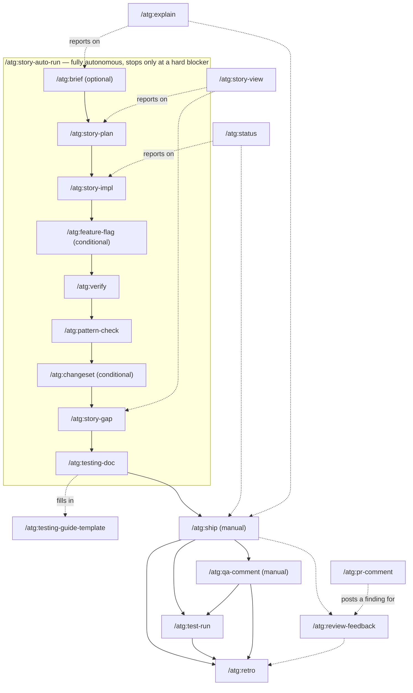

# Commands: what each one does, and how they fit together

20 `/atg:*` slash commands. Most exist to support one story's life cycle end to end; a
handful are cross-cutting tools you can reach for at any point in that life cycle.

## Life-cycle commands

| Command | Stage | What it does |
|---|---|---|
| `/atg:brief` | Plan (optional) | Socratic pre-story analysis — surfaces ambiguities and cross-cutting concerns before `story-plan` runs. |
| `/atg:story-plan` | Plan | Creates a branch-split implementation plan for a WBPR story — LOC estimate, feature-flag strategy, branch breakdown, As-built placeholder. |
| `/atg:story-impl` | Implement | Executes the story-plan for the current branch — aligns git state, builds a work queue from `implementation-plan.md`. |
| `/atg:feature-flag` | Implement (conditional) | Generates a single-file feature flag (interface + Noop + Enabled + ProxyFactory) and wires it into the service. |
| `/atg:verify` | Quality gate | Runs all quality gates (tests, Detekt, CodeNarc, Kover) and auto-fixes violations — the gate before `ship`. |
| `/atg:pattern-check` | Quality gate | Cross-references the PR diff against existing codebase patterns and project rules to catch antipatterns before shipping. |
| `/atg:changeset` | Quality gate (conditional) | Pointer to the monorepo changeset procedure — CI requires a `.changeset` for service/ui PRs unless skip-changelog. |
| `/atg:story-gap` | Pre-ship check | Verifies every acceptance criterion from the story is addressed before shipping. |
| `/atg:testing-doc` | Pre-ship check | Generates testing documentation (a `TESTING-GUIDE.md`, optionally scenario files with `--with-scenarios`). |
| `/atg:testing-guide-template` | (helper) | The merged template `testing-doc` fills in — not run on its own. |
| `/atg:ship` | Ship (manual) | Creates a PR once `verify` passes — respects the monorepo PR template, adds ATG context, transitions the Jira ticket. |
| `/atg:qa-comment` | Post-merge (manual) | Drafts and posts QA testing steps as a Jira comment — an HTTP guide for QA to run on dev/stage after merge. |
| `/atg:test-run` | Post-merge | Executes the scenarios from a `TESTING-GUIDE.md` — authenticates, runs each step via curl, asserts results, generates `TESTING-PROGRESS.md`. |
| `/atg:retro` | Wrap-up | Post-merge retrospective — mines session artifacts and suggests durable patterns for the user to review and selectively add to `CLAUDE.md`/`.claude/rules/`. |
| `/atg:story-auto-run` | Orchestrator | Chains `brief → story-plan → story-impl → (feature-flag) → verify → pattern-check → (changeset) → story-gap → testing-doc` for one branch, fully autonomous, stopping only at a hard blocker. `ship` and `qa-comment` stay manual. |

## Cross-cutting commands

Not tied to one stage — reach for these at any point in a story's life cycle.

| Command | What it does |
|---|---|
| `/atg:status` | Quick multi-branch story status overview — shows which branches are merged, open, or pending. |
| `/atg:explain` | Plain-language brief of what a ticket/branch changes — verdict, before/after examples, behavior matrix, merge confidence. |
| `/atg:story-view` | Renders a story's current life-cycle position (`brief → ship → docs → retro`) as a read-only visual dashboard, published via Artifact. |
| `/atg:review-feedback` | Unified PR comment classifier and resolver — handles both human-reviewer comments and bot comments in one flow. |
| `/atg:pr-comment` | Posts a single, concise inline PR review comment (finding + proposed fix) on GitHub. |

## How they reference each other

Edges below come straight from `/atg:*` mentions inside each command file — i.e. where one
command's instructions explicitly point at another.

- **The auto-run chain** (`story-auto-run`) is the backbone: `brief → story-plan → story-impl
  → feature-flag → verify → pattern-check → changeset → story-gap → testing-doc`. Every
  command in that chain also stands alone — you can run `/atg:verify` by itself without ever
  touching `story-auto-run`.
- **`ship`** sits right after the chain (not part of it — stays manual) and fans out to
  everything post-merge: `changeset`, `qa-comment`, `retro`, `review-feedback`, `test-run`,
  `testing-doc`, `verify`.
- **`testing-doc` → `testing-guide-template`**: `testing-doc` reads the template command's
  content to fill in `TESTING-GUIDE.md`; `test-run` then executes what `testing-doc` produced.
- **`qa-comment`** references `test-run`, `testing-doc`, and `retro` — it's a sibling of
  `test-run` (Jira-facing instead of curl-executing) that also feeds into wrap-up.
- **`pr-comment`** feeds into **`review-feedback`**: a single posted finding is exactly the
  kind of thing `review-feedback` later classifies and resolves.
- **`explain`** and **`story-view`** are the two "summarize everything" tools — both reference
  most of the life-cycle commands (`brief`, `pattern-check`, `story-gap`, `verify`, plus
  `ship`/`status`/`review-feedback` for `explain`) because their job is to report on where a
  story stands across all of them, not to hand off to a specific next step.
- **`status`** references `story-impl`, `ship`, `verify`, `review-feedback`, `retro` — same
  reporting role as `explain`/`story-view`, but scoped to "which branches are at which stage"
  rather than one story's detail.

## Workflow diagram

Dashed edges are "reports on" / "feeds into" relationships; solid edges are the sequential
hand-off order. `story-auto-run` runs the boxed chain unattended; `ship` and `qa-comment` are
deliberately left as manual steps even when the rest of the chain ran automatically.
